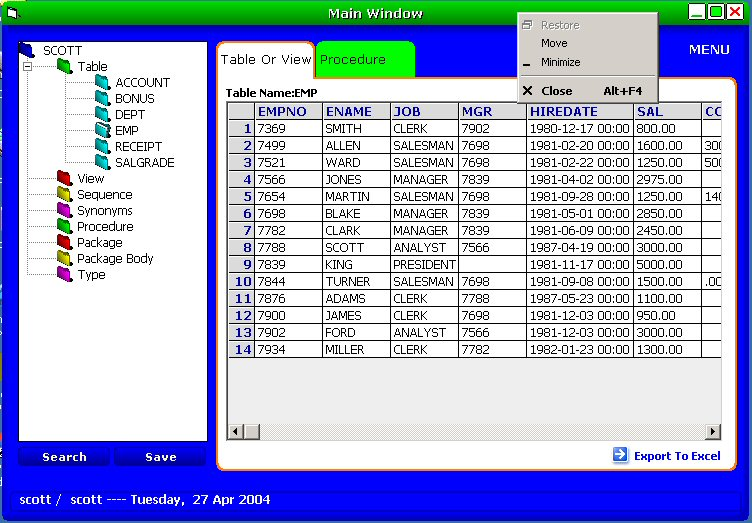



## Oracle VB Project

### Description

Hi,

This project gives you an idea how to access ORACLE through VB and ADO. Project describe How you interacting with ORACLE Table, view, Stored Procedure, Type, Package, Package Body, Synonyms, Sequence etc. I developed an Active X Skin which is used throughout the project. If you want to test the Skin just put the controls (OFrmCtl, Edge Right, Edge Bottom, Edge Region) in a form and run the project. Please close the project from FORM CLOSE Button, otherwise IDE will be crashed. Please check all the menus and form. Now, I’m trying to develop this project in Visual Basic.NET. Resize the form From X Axis and Y axis. Check it out.

Using of My developed Active X Skin and other components are strongly prohibited.
 
### More Info
 

             |
---                |---
**Submitted On**   |2004-04-21 09:53:02
**By**             |[Debghosh](https://github.com/Planet-Source-Code/PSCIndex/blob/master/ByAuthor/debghosh.md)
**Level**          |Advanced
**User Rating**    |4.5 (18 globes from 4 users)
**Compatibility**  |VB 6\.0
**Category**       |[Databases/ Data Access/ DAO/ ADO](https://github.com/Planet-Source-Code/PSCIndex/blob/master/ByCategory/databases-data-access-dao-ado__1-6.md)
**World**          |[Visual Basic](https://github.com/Planet-Source-Code/PSCIndex/blob/master/ByWorld/visual-basic.md)
**Archive File**   |[Oracle\_VB\_1737944262004\.zip](https://github.com/Planet-Source-Code/debghosh-oracle-vb-project__1-53409/archive/master.zip)

